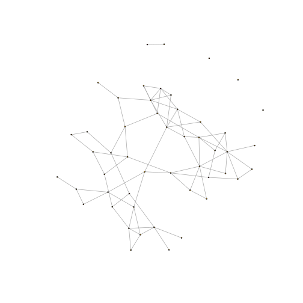
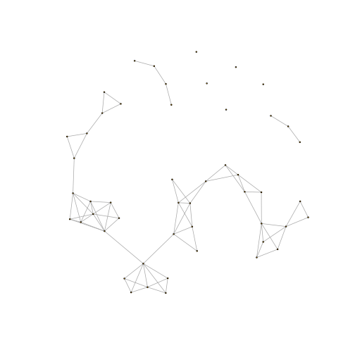
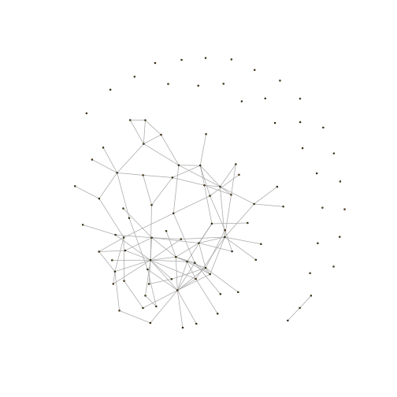
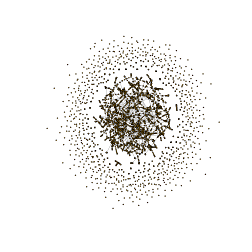

# rclustnet
Generate a random graph with desired size, clustering coefficient, and degree distribution

This uses a fast network growth algorithm. It is not an exact 
algorithm, so the resulting clustering coefficient may differ 
slightly from the requested value. Users may provide their own 
R functions to sample from the degree distribution.

* Citation: Volz, EM, Physical Review E, 2004

# examples

Let's generate a random graph with a Poisson degree distribution

```r
library(rclustnet)
g <- rclustnet( n=50, CC = .25, rdegdist='pois', lambda = 3 )
plot.igraph( g ,vertex.size=1 , vertex.label=NA)
```



Let's increase the clustering: 

```r
g <- rclustnet( n=50, CC = .50, rdegdist='pois', lambda = 3 )
plot.igraph( g ,vertex.size=1 , vertex.label=NA)
```



Let's make one with a skewed degree distribution:

```r
g <- rclustnet( n=100, CC = .15, rdegdist='geom',prob=.25 )
plot.igraph( g ,vertex.size=1 , vertex.label=NA)
```



Let's make a big one: 

```r
g <- rclustnet( n=5e3, CC = .3, rdegdist='nbinom', size = 20, prob=.9 )
plot.igraph( g ,vertex.size=0, vertex.label=NA)
```



Note that this took less than thirty seconds to generate.
